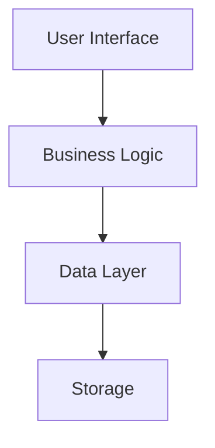
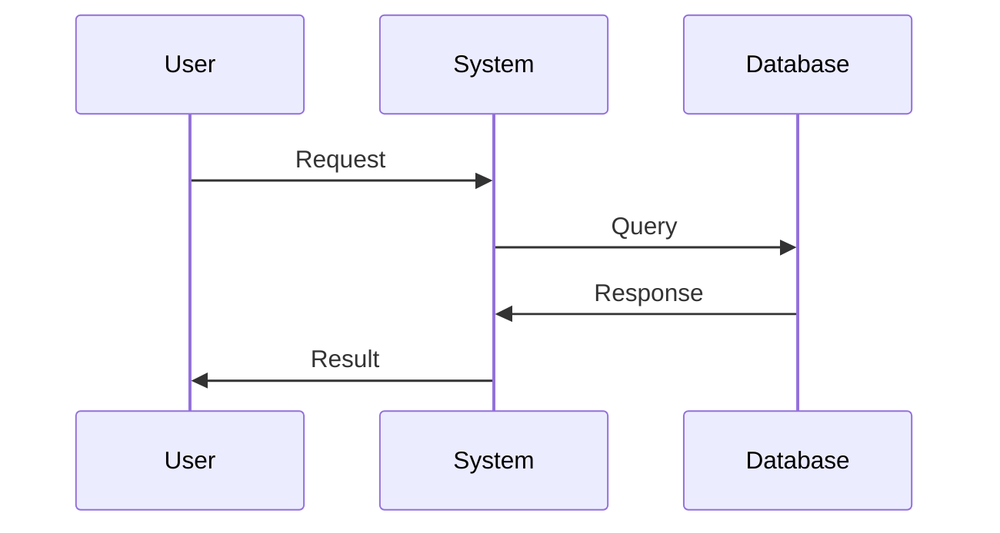

# Design Document - foo

## Architecture Overview

```mermaid
graph TD
    A[User Interface] --> B[Business Logic]
    B --> C[Data Layer]
    C --> D[Storage]
```

## System Components

### Component 1
Description of component 1

### Component 2  
Description of component 2

## Data Flow

```mermaid
sequenceDiagram
    participant U as User
    participant S as System
    participant D as Database
    
    U->>S: Request
    S->>D: Query
    D->>S: Response
    S->>U: Result
```
