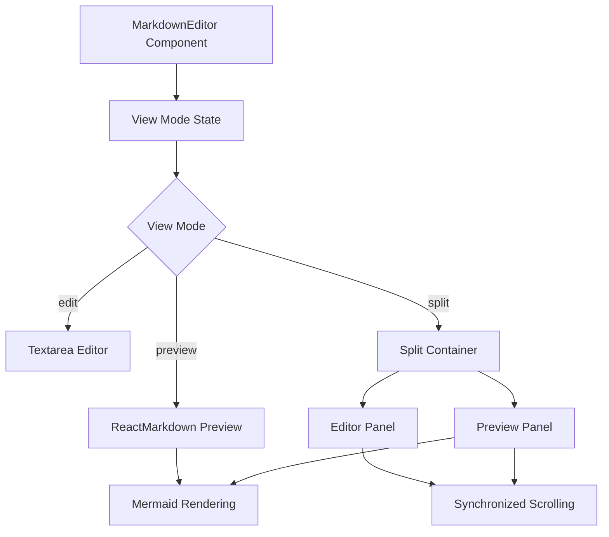
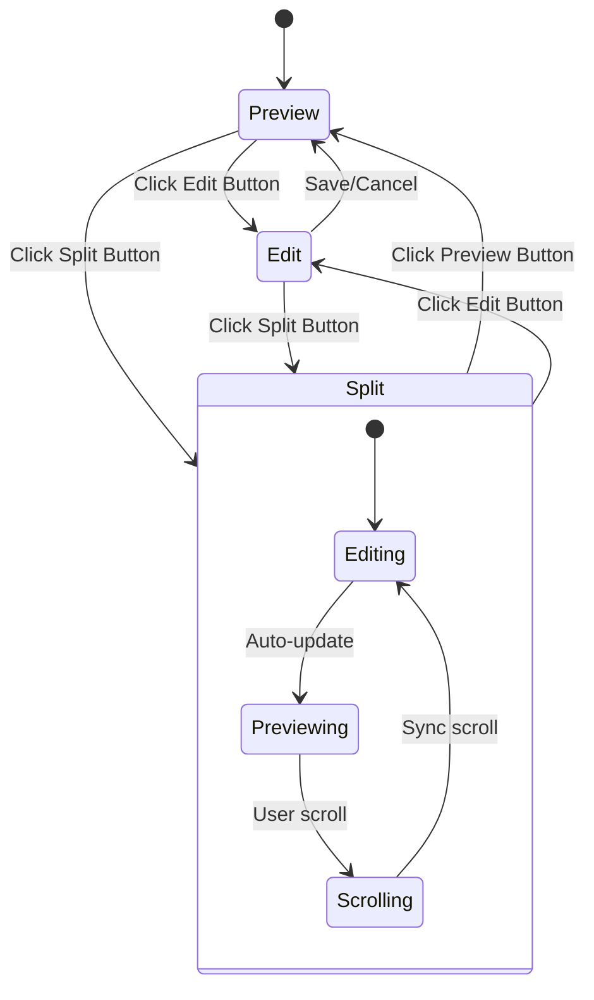
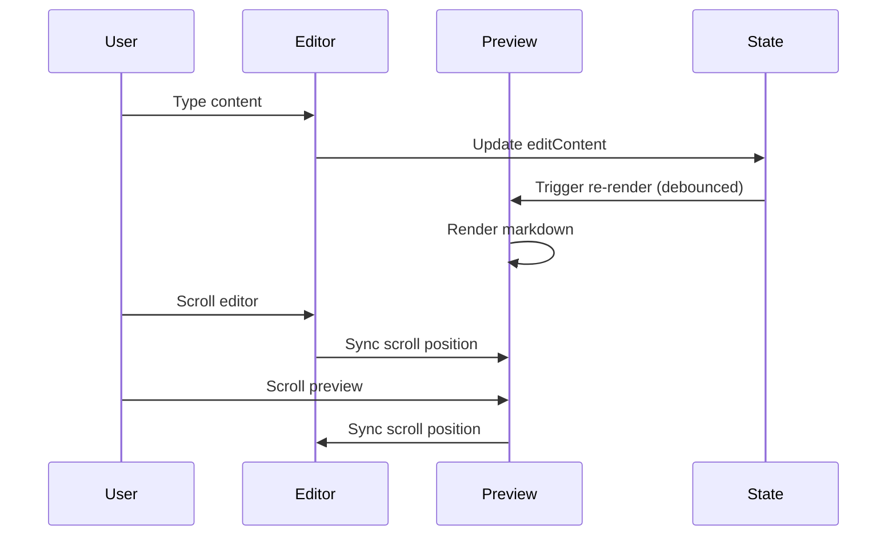

# Design Document - Markdown Preview Feature

## Architecture Overview

## Component Architecture

### MarkdownEditor Component
The main component that manages the markdown editing experience with three distinct view modes:
- **Preview Mode**: Shows only the rendered markdown
- **Edit Mode**: Shows only the source editor
- **Split Mode**: Shows both editor and preview side-by-side

### View Mode Controls
A toolbar with three buttons allowing users to switch between different viewing modes:
- 👁️ Preview - View rendered content only
- ✏️ Edit - Edit source markdown only
- 📄 Split - Side-by-side editing and preview

### Split View Container
When in split mode, the container divides the available space:
- Left panel: Source editor with syntax highlighting
- Right panel: Live preview with real-time updates

## State Management

## Data Flow

## Technical Implementation

### Synchronized Scrolling
The split view implements proportional scrolling between editor and preview:
- Calculate scroll percentage in source panel
- Apply same percentage to target panel
- Bidirectional synchronization

### Auto-save with Debouncing
Changes are automatically saved with a 800ms delay to prevent excessive file operations while maintaining responsiveness.

### Responsive Design
The interface adapts to smaller screens by:
- Stacking split panels vertically on mobile
- Adjusting toolbar layout for narrow screens
- Maintaining usability across device sizes