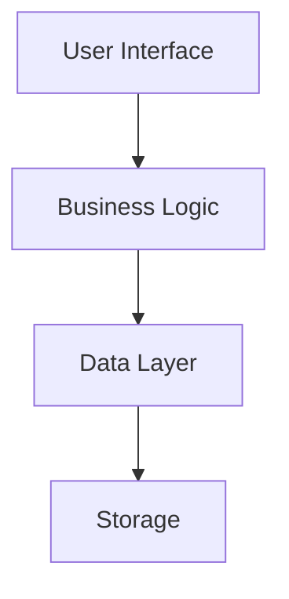
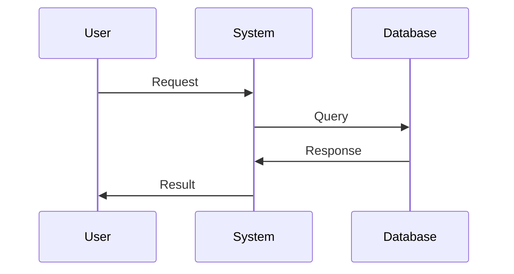

# SpecDev - Specification Development Tool

SpecDev is a VS Code/Cursor extension that implements a Kiro IDE-style workflow for managing software specifications. It provides a structured approach to documenting requirements, design, and tasks with markdown support and Mermaid diagrams.

## Features

- **Three-Tab Interface**: Requirements, Design, and Tasks
- **Markdown Support**: Full markdown editing with syntax highlighting
- **Mermaid Diagrams**: Support for Mermaid diagrams in the Design tab
- **Task Management**: Interactive checkboxes for task completion tracking
- **File Storage**: Automatic saving to `.specdev` folder in workspace
- **Git Integration**: Files can be committed or ignored as needed

## Installation

### Development Setup

1. Clone or download the project:
   ```bash
   git clone https://github.com/tonidy/specdev-cursor-plugin.git
   cd specdev-cursor-plugin
   ```

2. Install dependencies:
   ```bash
   npm install
   ```

3. Compile the TypeScript:
   ```bash
   npm run compile
   ```

4. Open in VS Code and press F5 to run in a new Extension Development Host window.

### From VSIX Package

1. Package the extension:
   ```bash
   npm install -g vsce
   vsce package
   ```

2. Install the generated `.vsix` file in VS Code:
   - Open VS Code
   - Go to Extensions view (Ctrl+Shift+X)
   - Click "..." menu and select "Install from VSIX..."
   - Select the generated `.vsix` file

## Usage

### Opening SpecDev

1. **Command Palette**: Press `Ctrl+Shift+P` (or `Cmd+Shift+P` on Mac) and type "Open SpecDev"
2. **Explorer Context Menu**: Right-click in the Explorer and select "Open SpecDev"

### Working with Features

SpecDev organizes specifications by features under `.specdev/specs/{feature-name}/`. Each feature contains:
- `requirements.md` - Requirements documentation
- `design.md` - Design documentation with Mermaid diagram support
- `tasks.md` - Task list with interactive checkboxes

Use the feature dropdown in the SpecDev interface to select and work with different features under development.

### Requirements Tab

Follow the EARS (Easy Approach to Requirements Syntax) format:

#### Enhanced Markdown Support

SpecDev now supports **GitHub Flavored Markdown (GFM)** with full feature support:

- **Tables**: Properly formatted tables with borders and styling
- **Task Lists**: Interactive checkboxes for requirements tracking  
- **Strikethrough**: ~~Crossed out text~~ for deprecated items
- **Code Blocks**: Syntax highlighting for multiple languages
- **Links**: Automatic link detection and external opening
- **Blockquotes**: Styled quote blocks for important notes

#### View Modes

Each tab now supports three view modes:
- **👁️ Preview**: Read-only formatted view with full markdown rendering
- **✏️ Edit**: Pure text editing with markdown syntax
- **📄 Split**: Side-by-side editing and preview with synchronized scrolling

#### Markdown Preview with Codebase Analysis

When you save requirements, SpecDev automatically:
1. **Scans your existing codebase** to detect technologies, dependencies, and project structure
2. **Shows a preview** of your requirements with contextual information about your project
3. **Provides insights** on how your requirements align with the existing codebase

The codebase analysis includes:
- **Technologies detected** (React, TypeScript, Express, etc.)
- **Key dependencies** from package.json
- **Source file structure** (src/, components/, etc.)
- **Configuration files** (tsconfig.json, webpack.config.js, etc.)

```markdown
# Requirements Document

## Introduction
[Project overview and context]

## Requirements

### Requirement 1
**User Story:** As a [role], I want [feature], so that [benefit]

#### Acceptance Criteria
1. WHEN [event] THEN [system] SHALL [response]
2. IF [precondition] THEN [system] SHALL [response]
```

### Design Tab

Create architecture diagrams using Mermaid:

```markdown
# Design Document

## Architecture Overview


## Data Flow

```

### Tasks Tab

Manage tasks with enhanced markdown support and multiple view modes:

#### Interactive Task Management

```markdown
# Task List

## Sprint 1

- [ ] Task 1: Implement user authentication
  - [ ] Create login form
  - [ ] Add validation
  - [ ] Integrate with backend API

- [x] Task 2: Design database schema
  - [x] Define user table
  - [ ] Define product table

## Progress Table

| Feature | Status | Priority | Assignee |
|---------|--------|----------|----------|
| Authentication | 🔄 In Progress | High | @dev1 |
| Database Schema | ✅ Complete | High | @dev2 |
| API Integration | 📋 Planned | Medium | @dev3 |
```

#### View Modes for Tasks

- **Preview Mode**: See formatted tasks with proper styling and tables
- **Edit Mode**: Raw markdown editing with full syntax support
- **Split Mode**: Edit and preview simultaneously with synchronized scrolling

## Kiro Workflow Integration

SpecDev follows the Kiro workflow methodology:

1. **Requirements First**: Define clear user stories and acceptance criteria
2. **Design Documentation**: Create visual diagrams and technical specifications
3. **Task Breakdown**: Convert requirements into actionable tasks
4. **Iterative Development**: Track progress with interactive checkboxes

## Kiro Workflow & Agent Integration

SpecDev is designed to work seamlessly with Cursor's AI agent and the Kiro workflow. **Document generation (requirements, design, tasks) is performed by interacting with the Cursor agent/chat, not directly by the extension.**

### How to Use the Agent for Document Generation

1. **Initialize SpecDev**: Use `/specdev init` to scaffold the `.specdev` folder and template files.
2. **Open the Cursor Agent/Chat**: Use the built-in Cursor chat or agent interface.
3. **Describe Your Feature or Requirement**: Enter a brief description or prompt for your feature in the chat.
4. **Let the Agent Guide You**: The agent will use the rules and templates provided by SpecDev (in `.cursor/rules/`) to:
   - Rewrite your prompt into structured, EARS-formatted requirements
   - Generate a detailed design document (with Mermaid diagrams)
   - Break down the design into actionable tasks
5. **Review Checkpoints**: After each step, the agent will prompt you to review and approve the generated document before moving to the next phase. You can request edits or regeneration as needed.
6. **Iterate**: Continue the feedback-revision cycle until you are satisfied with each document.

> **Note:** The extension itself does not call GPT or generate documents. All AI-powered generation is handled by the Cursor agent, using the rules and templates you provide.

### .cursor/rules Integration

When you run `/specdev init`, SpecDev copies workflow rules into `.cursor/rules/specdev-spec.mdc` and `.cursor/rules/specdev-tasks.mdc`. These rules guide the Cursor agent to follow the Kiro workflow, ensuring:
- Requirements are written in EARS format
- Design documents include diagrams and technical details
- Tasks are actionable and reviewed step-by-step

You can view or edit these rules to further customize your workflow.

### Current Limitation

> **Extensions cannot call GPT or LLMs directly in Cursor.**
>
> All AI-powered document generation is performed by the Cursor agent/chat, using the context, rules, and templates provided by your extension.

## File Management

### Git Integration

The `.specdev` folder is automatically created in your workspace. You can:

- **Commit files**: Add `.specdev/` to your repository to version control specs
- **Ignore files**: Add `.specdev/` to `.gitignore` for local-only documentation

### File Structure

```
your-project/
├── .specdev/
│   └── specs/
│       ├── feature-1/
│       │   ├── requirements.md
│       │   ├── design.md
│       │   └── tasks.md
│       └── feature-2/
│           ├── requirements.md
│           ├── design.md
│           └── tasks.md
└── ... (your project files)
```

## Configuration

No additional configuration is required. SpecDev works out of the box with any VS Code workspace.

## Development

### Building

The extension uses a unified build process that compiles both the extension and React webview:

```bash
# Build everything (extension + webview)
npm run build

# Development mode (build and launch VS Code)
npm run dev

# Package for distribution
npm run package
```

### Individual Build Commands

```bash
# Compile TypeScript extension only
npm run compile

# Watch for changes
npm run watch

# Build webview only
npm run build-webview

# Run tests
npm test
```

### Build Process

The build script (`scripts/build.mjs`) performs the following steps:
1. Builds the TypeScript extension using esbuild
2. Builds the React webview using Create React App
3. Copies the webview build files to `dist/webview/`
4. Creates a unified `dist/` folder ready for packaging

## Contributing

1. Fork the repository
2. Create a feature branch: `git checkout -b feature-name`
3. Make your changes
4. Test your changes
5. Submit a pull request

## License

MIT License - see LICENSE file for details.

## Changelog

### 0.4.0
- **Enhanced Markdown Support**: Full GitHub Flavored Markdown (GFM) with tables, task lists, strikethrough
- **Multiple View Modes**: Preview, Edit, and Split modes for all tabs (Requirements, Design, Tasks)
- **Improved Table Rendering**: Properly styled tables with borders, headers, and responsive design
- **Better Mermaid Integration**: Enhanced diagram rendering with error handling
- **Synchronized Scrolling**: Split mode with real-time scroll synchronization
- **Task List Enhancements**: Interactive task management with better visual indicators

### 0.3.0
- **Markdown Preview**: Live preview of requirements with codebase analysis
- **Codebase Scanning**: Automatic detection of technologies, dependencies, and project structure
- **React Webview**: Upgraded to React-based UI with better performance and features
- **Unified Build Process**: Single command builds both extension and webview
- **Enhanced UX**: Improved interface with better visual feedback

### 0.2.0
- **Feature-based organization**: Files now stored under `.specdev/specs/{feature-name}/`
- **Feature dropdown**: Select from available features under development
- **Create new features**: Add new features through the interface
- **Improved UI**: Better organization and user experience

### 0.1.0
- Initial release
- Basic three-tab interface
- Markdown editing support
- File saving to `.specdev` folder
- Mermaid diagram support in design tab
- Interactive task checkboxes

## Support

For issues and feature requests, please create an issue on the GitHub repository.

## Related Tools

- [Cursor IDE](https://cursor.sh/) - AI-powered code editor
- [Kiro IDE](https://kiro.aws/) - Amazon's specification-driven development tool
- [Mermaid](https://mermaid-js.github.io/) - Diagram and flowchart generator
