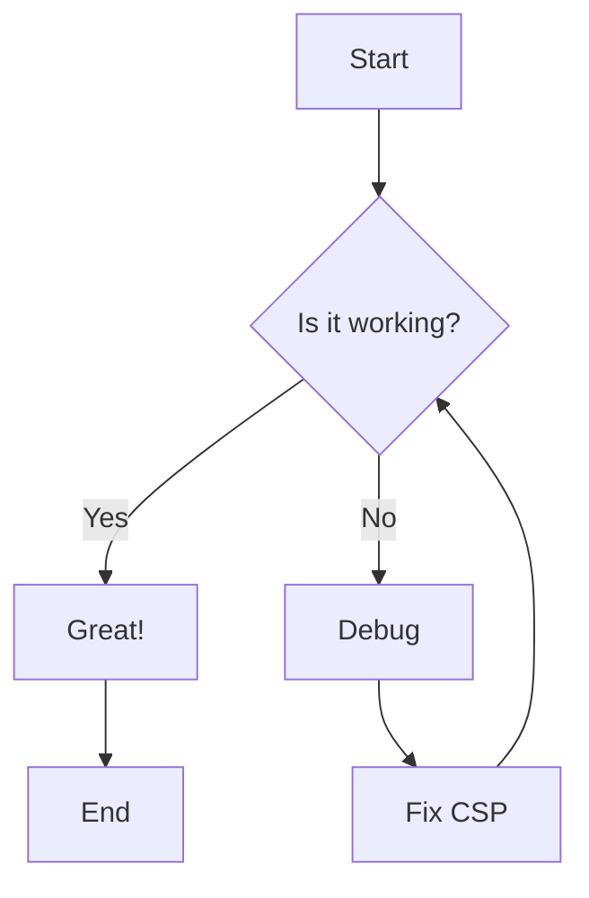
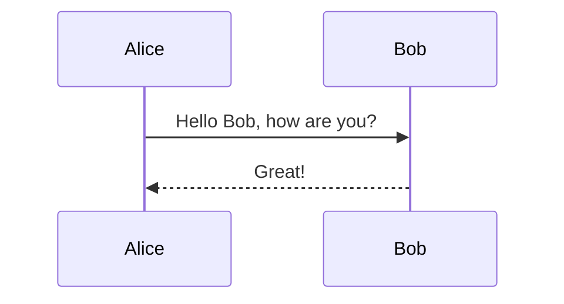
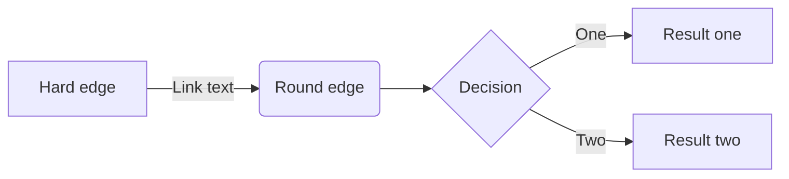

# Test Mermaid Diagram

This is a test to verify that mermaid diagrams are working in the webview.

```mermaid
graph TD
    A[Start] --> B{Is it working?}
    B -->|Yes| C[Great!]
    B -->|No| D[Debug]
    D --> E[Fix CSP]
    E --> B
    C --> F[End]
```

## Another Test

```mermaid
sequenceDiagram
    participant A as Alice
    participant B as Bob
    A->>B: Hello Bob, how are you?
    B-->>A: Great!
```

## Flowchart Test

```mermaid
flowchart LR
    A[Hard edge] -->|Link text| B(Round edge)
    B --> C{Decision}
    C -->|One| D[Result one]
    C -->|Two| E[Result two]
```
