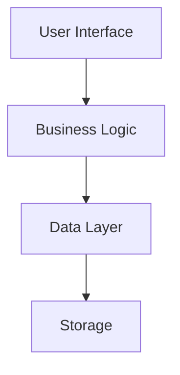

# Test Document with Table

This is a test document to verify that tables render correctly.

## Table Example

| Feature | Status | Priority |
|---------|--------|----------|
| Preview Mode | ✅ Complete | High |
| Edit Mode | ✅ Complete | High |
| Split Mode | ✅ Complete | High |
| Sync Scroll | ✅ Complete | Medium |

## Mermaid Diagram Test

## Another Table

| Component | Description | Status |
|-----------|-------------|--------|
| MarkdownRenderer | Renders markdown content | ✅ |
| ErrorBoundary | Catches rendering errors | ✅ |
| TaskList | Interactive task management | ✅ |

This should now work without causing the webview to go blank.
