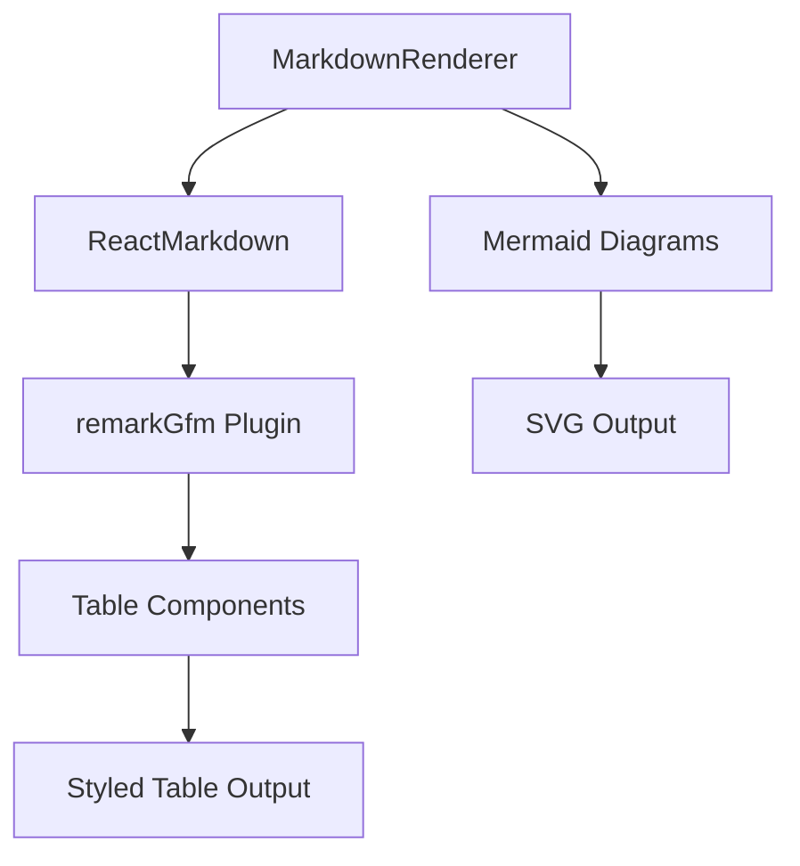
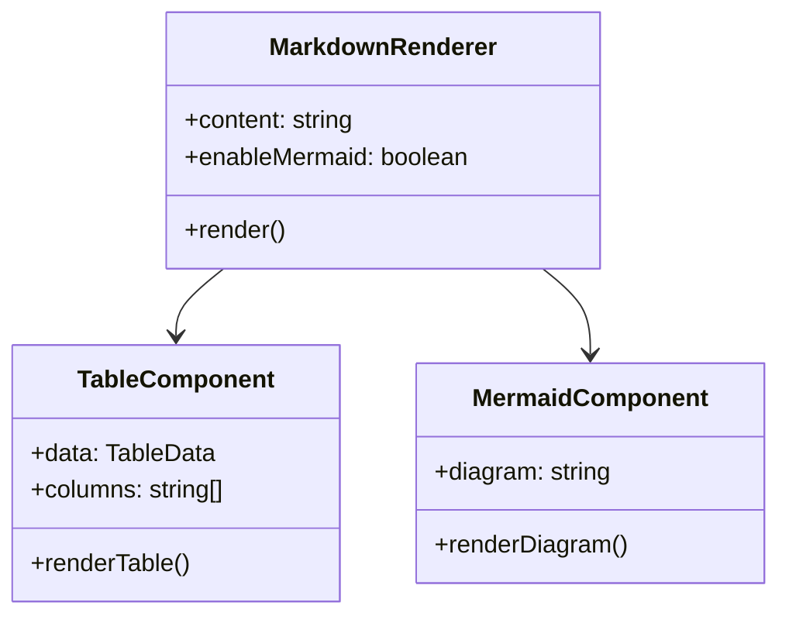
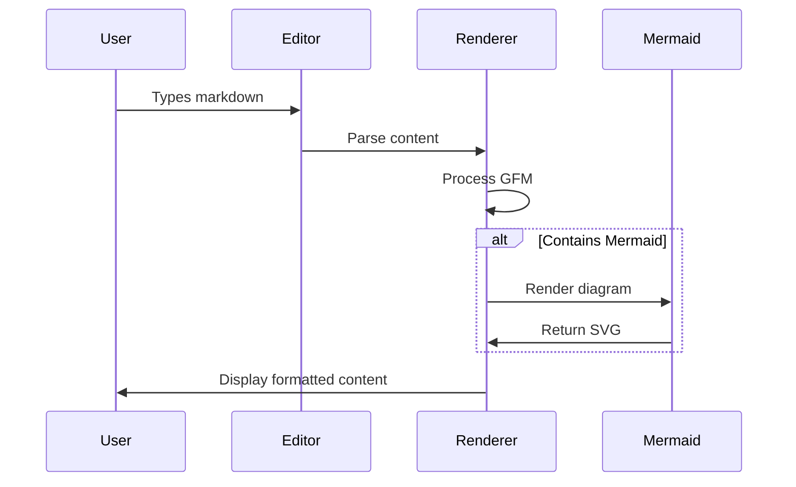

# Design Document - Table Test

## Architecture Overview

## Component Structure

## Data Flow

## Table Styling Specifications

| Property | Value | Purpose |
|----------|-------|---------|
| border-collapse | collapse | Clean table borders |
| border-spacing | 0 | Remove cell gaps |
| border | 1px solid | Define table boundaries |
| padding | 12px 16px | Cell content spacing |
| background-color | alternating | Row distinction |

## Responsive Design

The table component should:

1. **Horizontal Scroll**: When content exceeds container width
2. **Mobile Optimization**: Stack columns on small screens  
3. **Accessibility**: Proper ARIA labels and keyboard navigation
4. **Theme Integration**: Use VS Code color variables